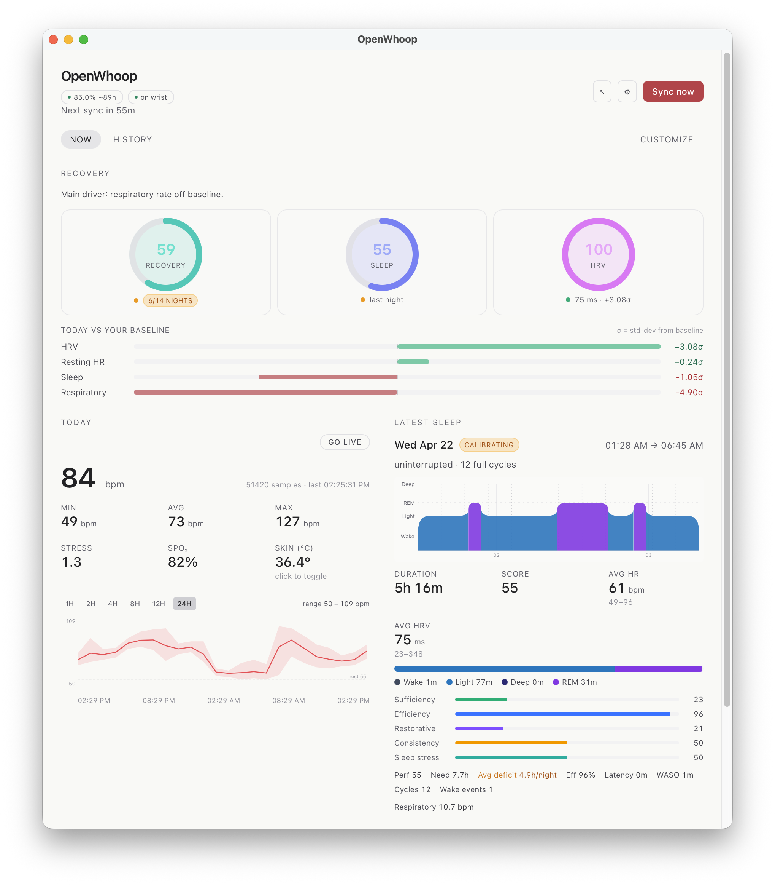
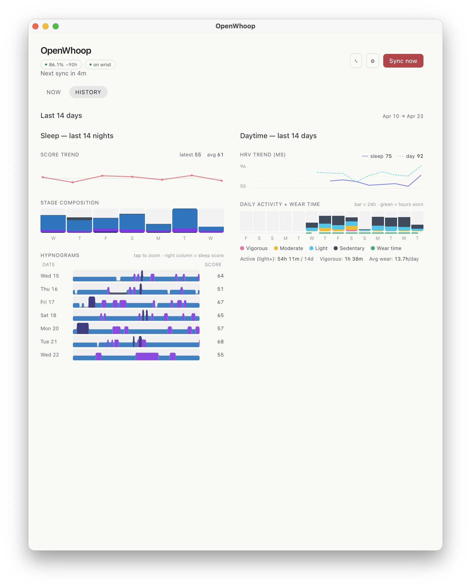
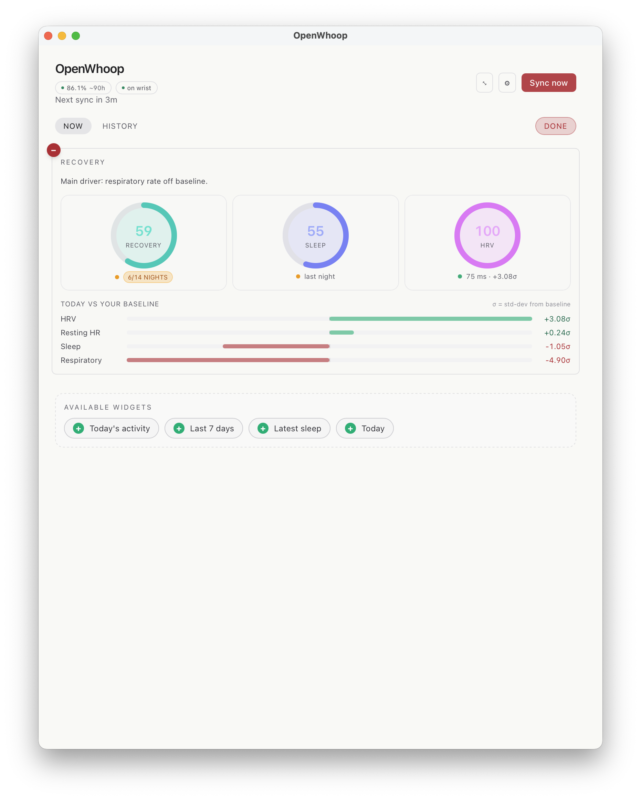
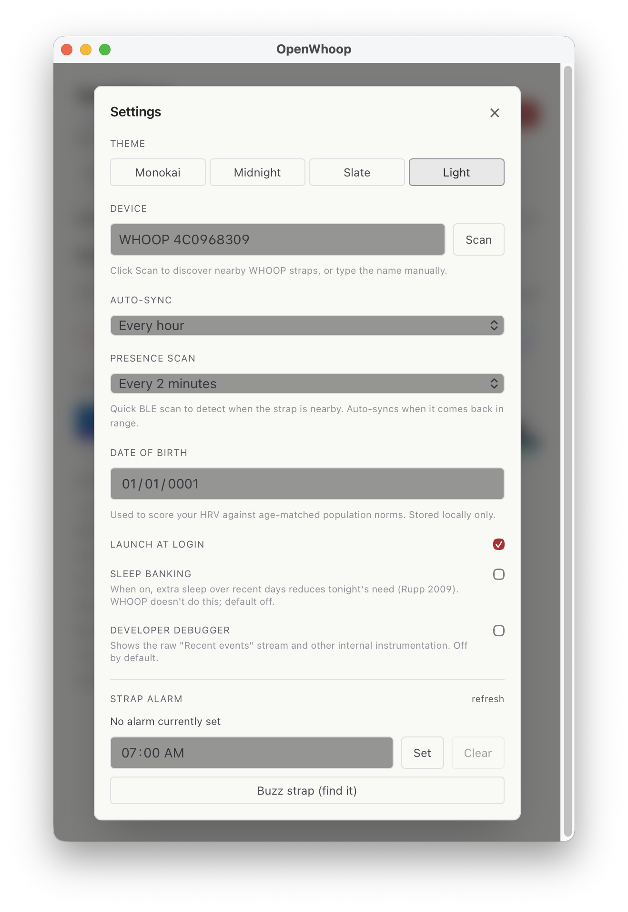
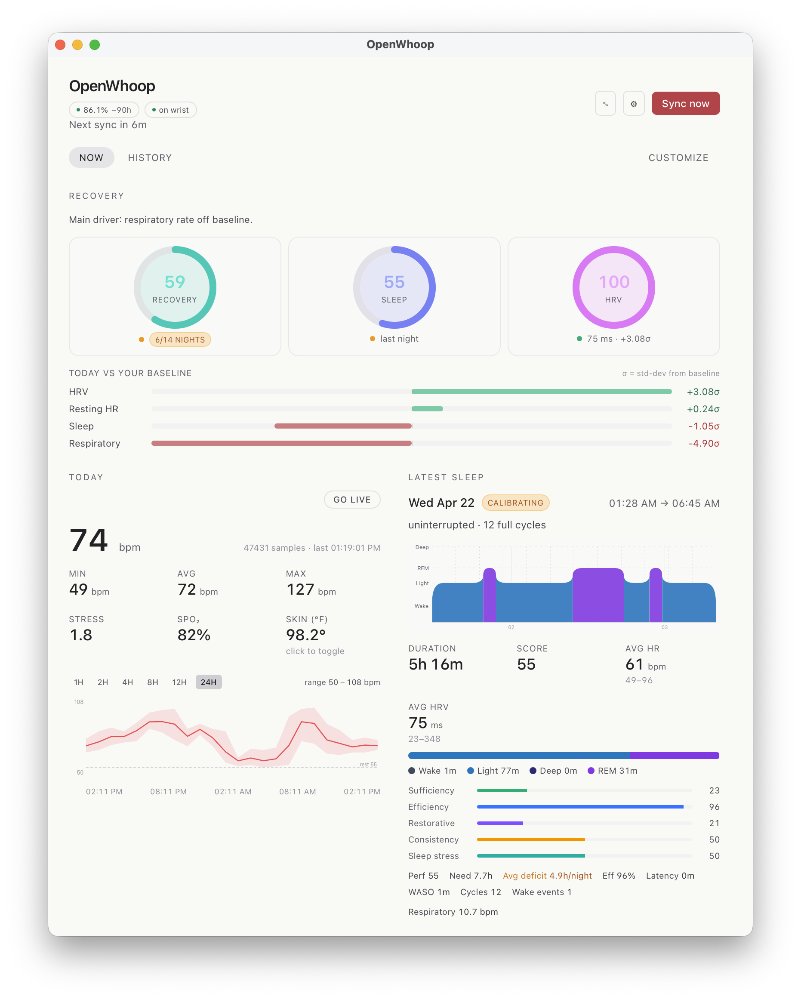
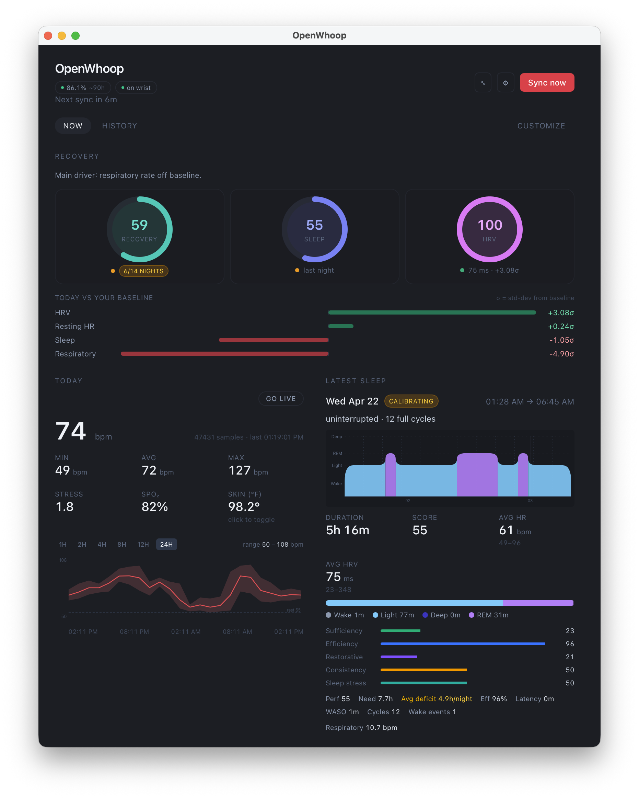
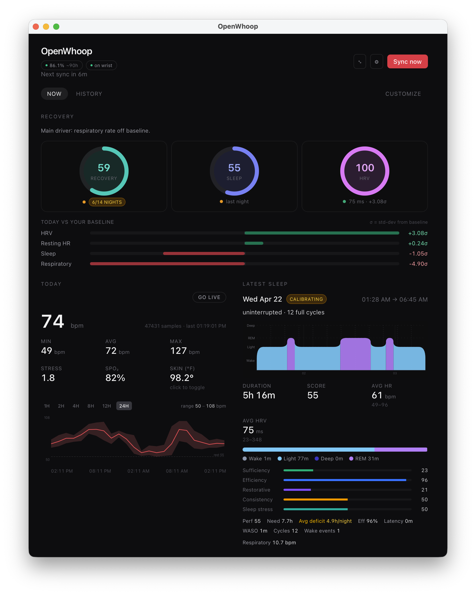
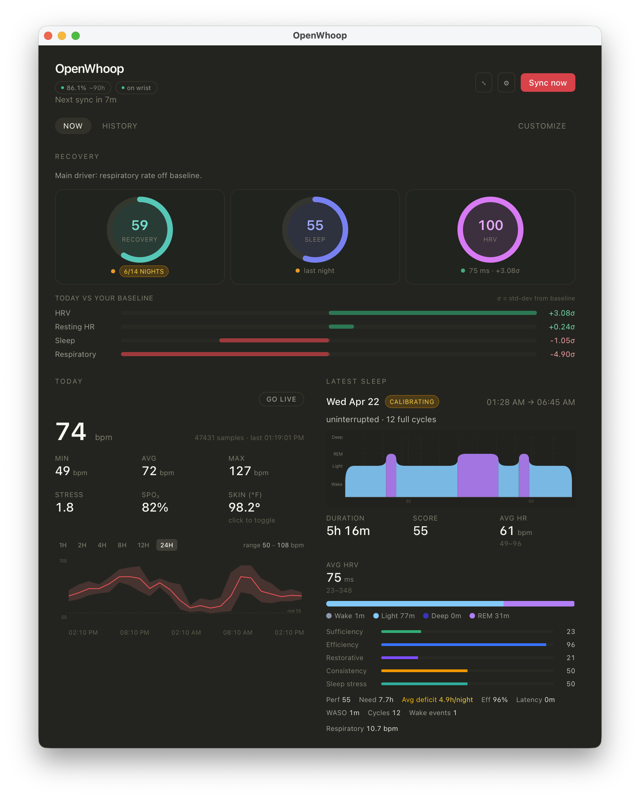

# OpenWhoop Tray

> **Credit & attribution**
>
> This project is an **add-on** — a macOS menu bar front-end — built on top of
> [**bWanShiTong/openwhoop**](https://github.com/bWanShiTong/openwhoop).
>
> All of the hard work — the reverse-engineered WHOOP Bluetooth protocol, the
> sync pipeline, the local SQLite schema, and every health algorithm
> (sleep staging, strain, HRV, recovery, stress) — lives in that upstream
> project by [**@bWanShiTong**](https://github.com/bWanShiTong). This
> repository would not exist without it.
>
> `openwhoop-tray` only adds a Tauri/React UI, a tray/menu-bar shell, a
> presence-based auto-sync scheduler, and a few glue commands on top of the
> upstream Rust crates (vendored as a git submodule under `vendor/openwhoop/`).
> If you're looking for the protocol, the library, or CLI usage, go there.
>
> **Note on the submodule:** `vendor/openwhoop` currently tracks my personal
> fork [`brennenawana/openwhoop`](https://github.com/brennenawana/openwhoop)
> on the `whoop-tray` branch, not the upstream `bWanShiTong/openwhoop` master.
> The fork carries a handful of tray-specific integration patches (extra
> Tauri-facing APIs, a WHOOP-aligned recovery score module, etc.) that haven't
> been upstreamed yet. If/when they land upstream, the submodule will be
> repointed at `bWanShiTong/openwhoop` directly.

---

A macOS menu bar companion for your WHOOP strap. Syncs data over Bluetooth, processes sleep/stress/strain metrics locally, and keeps everything on your machine — no cloud, no WHOOP subscription required.

Built with Tauri 2, React 19, Tailwind 4, and the [openwhoop](https://github.com/bWanShiTong/openwhoop) Rust library by [@bWanShiTong](https://github.com/bWanShiTong).

## Screenshots



| History | Customize layout | Settings |
|---|---|---|
|  |  |  |

### Themes

| Light | Slate | Midnight | Monokai |
|---|---|---|---|
|  |  |  |  |

## Features

- **Menu bar app** — lives in the tray, no dock icon. Left-click shows battery / presence / last sync at a glance.
- **Background sync** — configurable auto-sync (manual / 15m / 1h / 4h / daily) plus sync-on-startup.
- **Presence detection** — periodic BLE scan detects when the strap is nearby. Auto-syncs when you come back in range.
- **Dashboard** — current HR, min/avg/max, 24h sparkline, stress, SpO₂, skin temp (F/C toggle), latest sleep with HRV, 7-day summary.
- **Device status** — battery %, charging state, wrist-on/off, all read via the custom WHOOP protocol.
- **Alarm control** — set, clear, and read the strap's alarm from the settings panel. Includes a "Buzz strap" find-my-device button.
- **Device discovery** — scan for nearby WHOOP straps from the settings panel instead of typing the name manually.
- **Launch at login** — macOS LaunchAgent integration.

## Install

**macOS (Apple Silicon):** download the latest `.dmg` from [Releases](https://github.com/brennenawana/openwhoop-tray/releases/latest), open it, and drag **OpenWhoop.app** to **Applications**.

The build is ad-hoc signed but not notarized, so macOS Gatekeeper will block the first launch. Either:

- **Right-click** the app → **Open** → **Open** (one-time prompt), or
- From a terminal: `xattr -dr com.apple.quarantine /Applications/OpenWhoop.app`

On first launch, approve the Bluetooth permission prompt. The app runs in the menu bar (no Dock icon) — click the tray icon to open the dashboard.

Intel Macs, Linux, and Windows builds aren't published yet — build from source.

## Uninstall

1. Quit OpenWhoop from the tray menu, then drag **OpenWhoop.app** to the Trash.
2. Remove the data directory:
   ```sh
   rm -rf ~/Library/Application\ Support/dev.brennen.openwhoop-tray
   ```
3. If you enabled "Launch at login", remove the LaunchAgent:
   ```sh
   launchctl unload ~/Library/LaunchAgents/OpenWhoop.plist 2>/dev/null
   rm ~/Library/LaunchAgents/OpenWhoop.plist
   ```

## Data location

| Platform | Path |
|---|---|
| macOS | `~/Library/Application Support/dev.brennen.openwhoop-tray/` |
| Linux | `~/.local/share/dev.brennen.openwhoop-tray/` |
| Windows | `%APPDATA%\dev.brennen.openwhoop-tray\` |

Contains `db.sqlite` (all health data) and `config.json` (device name, sync interval, presence interval).

---

## Build from source

```sh
git clone --recursive https://github.com/brennenawana/openwhoop-tray
cd openwhoop-tray
pnpm install
pnpm tauri build
```

Forgot `--recursive`? Run `git submodule update --init --recursive`.

Outputs land in `src-tauri/target/release/bundle/macos/OpenWhoop.app` and `.../bundle/dmg/`.

For live development (hot-reload frontend, faster Rust builds): `pnpm tauri dev`.

## Architecture

```
openwhoop-tray/
├── src/                      # React frontend (TypeScript + Tailwind)
├── src-tauri/                # Rust backend (Tauri 2)
│   ├── src/lib.rs            # All Tauri commands, scheduler, presence loop
│   ├── Info.plist            # Bluetooth permission + LSUIElement
│   └── Cargo.toml            # Depends on openwhoop crates via path
└── vendor/
    └── openwhoop/            # git submodule (openwhoop library)
```

The Rust backend owns the BLE connection, SQLite database, and all algorithms. The React frontend is pure presentation — it calls Tauri commands and renders results.

## Publishing a release

1. Bump `version` in [src-tauri/tauri.conf.json](src-tauri/tauri.conf.json).
2. `pnpm tauri build` to produce `OpenWhoop.app` and the `.dmg`.
3. Ad-hoc sign: `codesign --force --deep --sign - src-tauri/target/release/bundle/macos/OpenWhoop.app`.
4. Tag: `git tag -a vX.Y.Z -m "OpenWhoop Tray vX.Y.Z" && git push origin vX.Y.Z`.
5. Create the GitHub release and attach the `.dmg`:
   ```sh
   gh release create vX.Y.Z \
     src-tauri/target/release/bundle/dmg/OpenWhoop_X.Y.Z_aarch64.dmg \
     --title "OpenWhoop Tray vX.Y.Z" \
     --notes "Release notes here"
   ```

For a clean Gatekeeper experience (no right-click-Open prompt), sign with an Apple Developer ID certificate and notarize via `xcrun notarytool` before attaching to the release.
